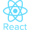

### Hi there 👋

<!--
**ymaryna/ymaryna** is a ✨ _special_ ✨ repository because its `README.md` (this file) appears on your GitHub profile.

Here are some ideas to get you started:

- 🔭 I’m currently working on ...
- 🌱 I’m currently learning ...
- 👯 I’m looking to collaborate on ...
- 🤔 I’m looking for help with ...
- 💬 Ask me about ...
- 📫 How to reach me: ...
- 😄 Pronouns: ...
- ⚡ Fun fact: ...
-->

Welcome to my GitHub! I'm Marina Cid, a Frontend developer and future Fullstack. When I am not searching for new knowledge or programming, I'm playing videogames or playing some sports with my friends. I love to know more and more about this wonderfull developers world 😄

### ✨ Languages I use

    

### ✨ Languages I've worked with

    
    

### ✨ Frontend Development

    
    
    
    
    

### ✨ Backend Development

    
    

### ✨ Database

    
    

### ✨ Software

    
    
    
    
    
    

### 😍 What i like to do:
- I like challenges, learning, LOGICAL PROBLEMS, helping, sharing and living !!!

### 💡 Goals for 2022:
- Keep growing as a developer
- Keep learning about technology
- Become skilled in MERN (MongoDB, Express, React, Nodejs)
- Grow as a person :)

### ⚡ My personal projects
- You can check my latest projects on my website! https://marinacid.es/

### 🛠 Interested in:
- Fronted, games, sports, design

